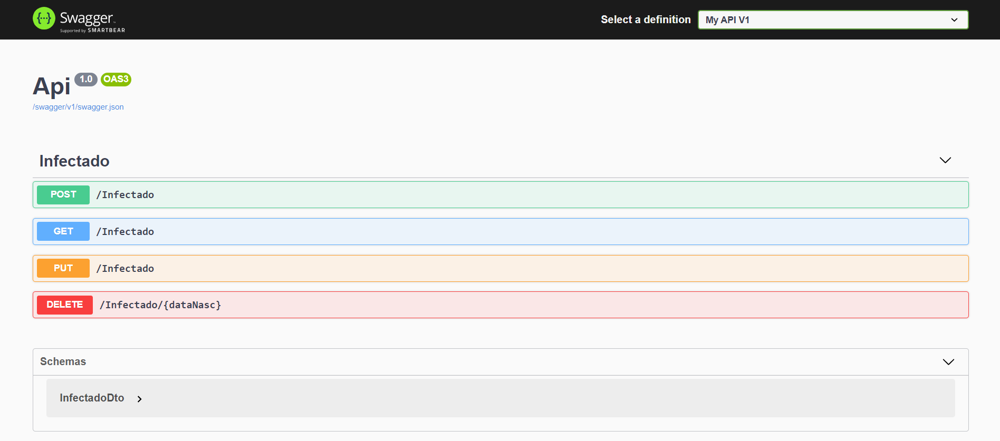

# 🚀 API .Net Core, integrada com MongoDB



Exemplo de aplicação .net core com mongodb.

Para teste:

https://localhost:5001/infectado

```json
{
	"dataNascimento": "1990-03-01",
	"sexo": "M",
	"latitude": -23.5630994,
	"longitude": -46.6565712
}
```
OBS: é preciso ter configurar o acesso ao banco no appsettings.

### Links Uteis:

- .net core - https://dotnet.microsoft.com/download

- visual code - https://code.visualstudio.com/download

- postman - https://www.postman.com/downloads/

- mongo atlas - https://www.mongodb.com/cloud/atlas/register


<hr>

<p align="center">
  
 </p>
 <p align="center">
  <a href="https://digitalinnovation.one/sign-up?ref=H395IYS4Z6">SE INSCREVER</a>
 </p>

